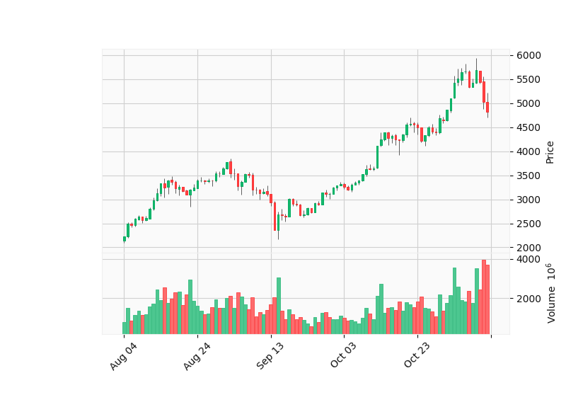

# CryptoTracker App



*Flask, Angular, SQLite3, and Docker*:
- ``ui``: Angular UI presents performance of cryptocurrencies
- ``backtesting_microservice``: Flask API to run backtesting of strategy - libraries/dependencies: ``backtesting.py``, and technical analysis: ``TA``/``TA-Lib``.
- ``mdi_microservice``: MDI (Market data and indicators) Microservice - Flask API to fetch market data from OKX, CoinGecko, and my LiveCoinWatch library which is an interface to the [LiveCoinWatch API](https://www.livecoinwatch.com/), deployed to [PyPi](https://pypi.org/project/LiveCoinWatch/1.0.0/).
- ``sentiment_microservice``: Flask API to scrape X/Twitter and determine sentiment.

## Backtesting Microservice: Strategy

### Bollinger Bands


### Simple Moving Average (SMA)


**Sample stategy**
- 10-day SMA below 30-day SMA.
- 10-day and 30-day SMA above 50-day SMA.
- 10-day, 30-day, and 50-day SMA below 200-day SMA.

### Relative Strain Index (RSI)

-

### The Moving Average Convergence/Divergence indicator


Purpose: Entry/exit points; trend confirmation; and risk management.

2 conditions:
- MACD above the MACD signal.
- MACD greater than 0.

The MACD indicator is derived from two exponential moving averages (EMAs) — the 12-day EMA and the 26-day EMA. The formula for MACD is as follows:

``MACDLine=12−dayEMA−26−dayEMA``

A signal line, often a 9-day EMA, is plotted on top of the MACD line. This signal line serves as a trigger for buy or sell signals.

``SignalLine=9−dayEMA``

The MACD histogram, the visual representation of the difference between the MACD line and the signal line, provides insights into the strength and direction of the trend.

``MACDHistogram=MACDLine−SignalLine``

## Architecture

### Docker
  - Docker Compose to build and host app: ```docker-compose.yml``` to create containers and run the app. Several versions, i.e. for different environments.
  - Reverse proxy (`nginx`) - web server, and reverse proxy. External user hits the nginx - distributes request to UI or a microservice.

### Cleaning

Prune Docker regularly:

- ``docker system prune``
- ``docker rmi $(docker images | awk '/^<none>/ {print $3}')``

### Microservices (Python)
Seperated to improve load time (thus if changes are made, not always need to reload whole back-end, or install to container dependencies of other microservices.) WIP: Sentiment scraping, sentiment analysis, LLM, etc..

***Flask*** app: including tests setup, configs and settings files, Dockerfile for running the Flask container, etc..
  - Flask - Back-End Python framework.
  - ```.env``` variable: Environment variables for Flask and SQLite3. Several versions, i.e. for different environments.
  - Optimised for large scale app structure, with `Blueprints`, `application factory` and several configs that can be extended from this seed project to any Prod-ready app.
  - uwsgi - WSGI server - direct support for popular NGINX web 
  - Flask code Testing.

### UI (TypeScript)
***Angular:*** Front-End JavaScript framework.

``ng generate component components/list --style=scss --project=algo-ui``

## Run Docker Containers

**NB. Setup the UI before Docker Compose**: 
[Angular Prerequisites] (https://github.com/angular/angular-cli#prerequisites) - that being, Docker, node, npm and angular-cli.
- Navigate to the `ui` directory. 
- Execute `ng build`; and with `--prod` to create a production build for Angular.

**Running Docker Compose:**

There are 4 Docker containers:
- 3 x Flask/Uwsgi - Flask web application with _uwsgi_ 
- 1 x Angular/Nginx - Angular web client

Both built using separate Dockerfiles, created and connected with Docker Compose, and which expand upon the respective official images from Docker Hub.

***Execute following commands:***
  - Run with (watch): ``docker compose up --build --wait && docker compose alpha watch``
  - ``docker compose watch docker-compose.yml && docker compose up``
  - ``docker-compose -f docker-compose.yml up --build``
  - Without cache ``docker-compose build --no-cache``

***Open Browser and type following URLs:***
  - `localhost` - the welcome message from Angular and a backend default message.
  - `localhost/api` - the welcome message from Flask.
  - `localhost/api/ping` - sample `json` from Flask.

Details:
- External requests hit the _nginx_ web server's port 80, and the response is by Angular or Flask depending on the URL. 
- _/api_ is sent to Flask docker container (port 5000; as per the _nginx.conf_ file. nginx is aware of both the Angular and Flask services.) 
- Flask container connects via port 1234 to the database.

## Env
- Create: ``python3 -m venv venv``
- Active: ``source venv/bin/activate``
- ***Requirements:***``pip freeze -r requirements.txt | sed '/freeze/,$ d'``

## Twitter Sentiment Analysis

CLI: `main.py`
- `--f`: Set to True if wish to use FinBERT model rather than Roberta.

Sample output:

    `[{'label': 'Negative', 'score': 0.9966174960136414}, {'label': 'Positive', 'score': 1.0}, {'label': 'Negative', 'score': 0.9999710321426392}, {'label': 'Neutral', 'score': 0.9889441728591919}]`

## Tests

### Running the Python Tests
- Flask (Python) unit tests are in the `server/tests` directory and managed by `manage .py` Python file.
- Run with: ``docker-compose -f docker-compose.yml run --rm crypto_tracker_flask python manage.py test``

### Running UI unit tests
Run `ng test` to execute the unit tests via [Karma](https://karma-runner.github.io).

## APIs

``http://127.0.0.1:5000/historic_values_today/USD/XAU/``

### Sources:

mM LiveCoinWatch library (deployed to PyPi), which is an interface to the [LiveCoinWatch API](https://www.livecoinwatch.com/):
  - GitHub: [github.com/MathematicusLucian/LiveCoinWatch](https://github.com/MathematicusLucian/LiveCoinWatch)
  - PyPi: [pypi.org/project/LiveCoinWatch/1.0.0/](https://pypi.org/project/LiveCoinWatch/1.0.0/)

OKX:
- https://search.r-project.org/CRAN/refmans/okxAPI/html/get_history_candles.html
- https://www.okx.com/help/how-can-i-do-spot-trading-with-the-jupyter-notebook
- https://www.okx.com/help/how-can-i-do-derivatives-trading-with-the-jupyter-notebook
- https://www.okx.com/docs-v5/en/#overview-demo-trading-services
- https://www.okx.com/docs-v5/en/#overview-market-maker-program
- https://www.okx.com/docs-v5/en/#overview-broker-program
- https://www.okx.com/docs-v5/en/#spread-trading
- https://www.okx.com/docs-v5/en/#order-book-trading

GoldApi.io:
- https://www.goldapi.io/dashboard

## Backtseting Data

***DOGE:** [Kaggle](https://www.kaggle.com/datasets/svaningelgem/crypto-currencies-daily-prices?select=DOGE.csv)

## LLM Models (Machine Learning) for Sentiment Analysis

### Roberta
[https://huggingface.co/cardiffnlp/twitter-roberta-base-sentiment](https://huggingface.co/cardiffnlp/twitter-roberta-base-sentiment)

### FinBERT (Financial Roberta)
***Finbert Tone:*** Fine-tuned on 10,000 manually annotated (positive, negative, neutral) sentences from analyst reports. [https://huggingface.co/yiyanghkust/finbert-tone](https://huggingface.co/yiyanghkust/finbert-tone)